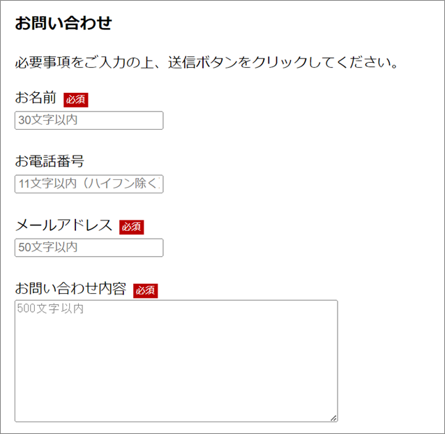
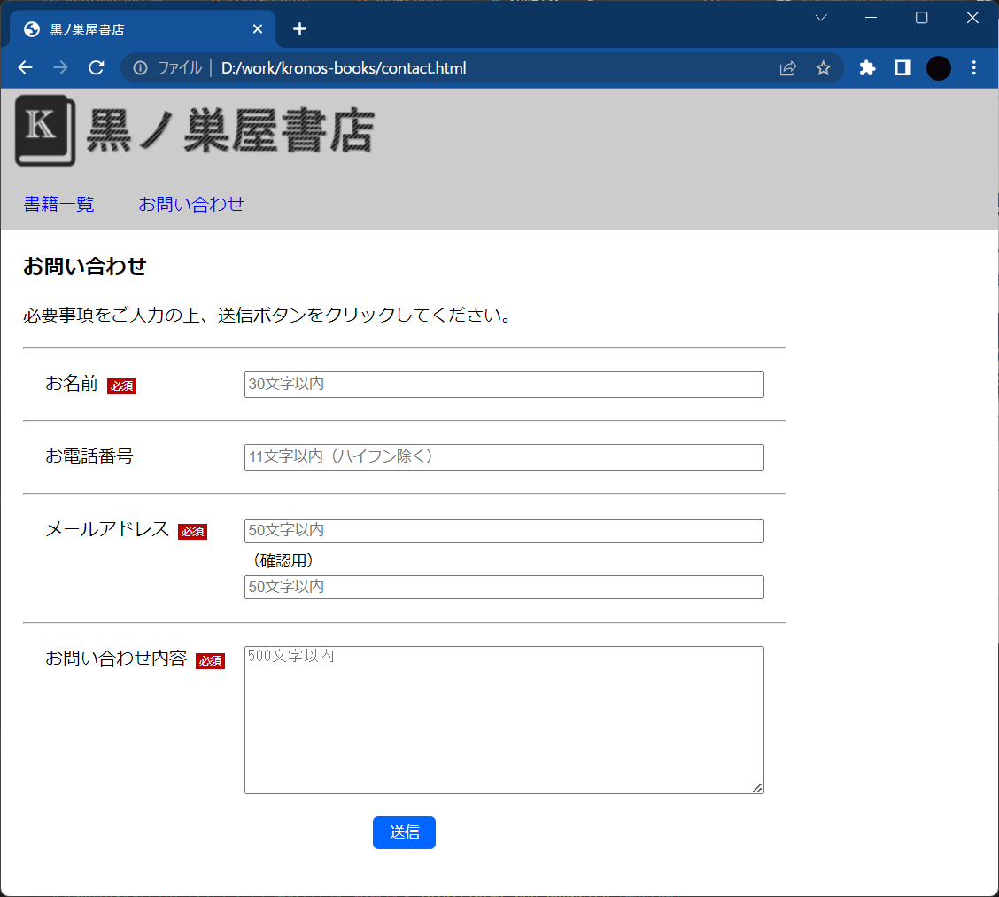

# HTML/CSS演習

本演習問題用のフォルダ（以下、演習フォルダ）を作成して各演習を進めてください。

 

演習を進めながら書籍一覧ページとお問い合わせページを作成していきます。以下のようなファイルの構成で作成します。

  

index.html（書籍一覧ページ）とcontact.html（お問い合わせページ）は以下の構成で作成します。

  

## 1 書籍一覧（index.html）

### 演習1（画像の表示）

演習フォルダにimgフォルダを作成し、以下の画像をkronos-books-logo.pngというファイル名で保存します。 演習フォルダ直下にindex.htmlを作成し、保存した画像をheader部に表示します。画像は相対パスで指定してください。

  

[解答例](ans/ans-01.md)

  

### 演習2（背景色の指定）

CSS（スタイルシート）でheaderタグの背景色を「#CCCCCC」に変更します。

  

[解答例](ans/ans-02.md)

  

### 演習3（メニューリンクの追加）

タイトルの下に「書籍一覧」リンクと「お問い合わせ」リンクを追加します。リンクはnavタグ内に配置します。

  

[解答例](ans/ans-03.md)

  

### 演習4（メニューリンクのブロック化と装飾）

メニューリンクのクラス名を「menu-item」とし、以下のスタイルシートを適用します。

- ブロック化（ display: block; ）
- 内部余白 - 上下：10px、左右：20px
- フォントサイズ - 1rem

  

[解答例](ans/ans-04.md)

  

### 演習5（メニューリンクの整列）

メニューリンクを左から横並びに配置します。

  

[解答例](ans/ans-05.md)

  

### 演習6（メニューリンクの追加装飾）

メニューリンクを青文字にし、文字の下線を非表示にします。

  

[解答例](ans/ans-06.md)

  

### 演習7（メニューリンクのマウスオーバー）

メニューリンクにマウスオーバーした時に文字色と背景色を以下のようにします。

- 文字色 - 白
- 背景色 - R:0、G:0、B:170

  

[解答例](ans/ans-07.md)

  

### 演習8（書籍一覧の表示）

sectionタグ内に次のような書籍一覧表を追加します。表のボーダーも表示しますが、後の演習でCSSによるボーダーに変更します。また、mainタグに対して外部余白として上下左右に「20px」を指定します。

  

[解答例](ans/ans-08.md)

  

### 演習9（書籍一覧のボーダー）

書籍一覧表のボーダーをCSSで表現します。また、表の項目の背景色を変更します。

- ボーダー - 線の太さ：1px、線の色：黒、線の形式：1本線
- 項目の背景色 - R:142、G:184、B:255

  

[解答例](ans/ans-09.md)

  

### 演習10（ページ全体の余白除去）

ページ全体の周りにある余白を消去します。

> Chromeの開発者ツールを使って、どこに余白ができているのか確認してみてください。

  

[解答例](ans/ans-10.md)

  

## 2 お問い合わせフォーム（contact.html）

### 演習11（お問い合わせフォームの作成）

次のようなお問い合わせフォームを作成します。

| 項目 | タグ | type属性 | 概要 |
|:--------|:---:|:---:|:----|
| お名前 | input | text | ID: name 最大入力文字数: 30 プレースホルダー: "30文字以内" 入力必須 |
| お電話番号 | input | tel |ID: tel 最大入力文字数: 11 プレースホルダー: "11文字以内（ハイフン除く）" |
| メールアドレス | input | email |ID: mail 最大入力文字数: 50 プレースホルダー: "50文字以内" 入力必須 |
| お問い合わせ内容 | textarea | - | ID: content 縦幅: 10 横幅: 50 最大入力文字数: 500 プレースホルダー: "500文字以内" 入力必須 |
| 送信 | input | submit | ID: btn-send |

※上記項目をformタグ内に配置してください。

 

必須項目が未入力の状態で、送信ボタンをクリックすると、入力を促すメッセージが表示されることを確認しましょう。

  

[解答例](ans/ans-11.md)

  

### 演習12（必須バッチの追加）

必須項目のラベルの横に必須バッチを追加します。

  

[解答例](ans/ans-12.md)

  

### 演習13（画像のリンク化）

黒ノ巣屋書店のロゴ（画像）をクリックすると、書籍一覧（index.html）を表示します。

  

[解答例](ans/ans-13.md)

  

ここまでで一通りページは完成です。お疲れ様でした。

  

### 追加課題（デザインの調整）

お問い合わせ画面を次のように整形にしてみましょう。

